# Kanvert Document Conversion Service - Comprehensive Functionality Assurance Design

## Overview

Kanvert is a production-ready FastAPI-based document conversion service designed for professional document processing with native Model Context Protocol (MCP) integration. The system specializes in converting Markdown content to high-quality PDF documents using WeasyPrint, while providing a modular architecture that supports future expansion to additional formats.

**Core Value Proposition**: AI-enabled document conversion with enterprise-grade reliability, comprehensive error handling, and extensible architecture for automated content workflows.

## Technology Stack & Dependencies

### Core Framework Stack
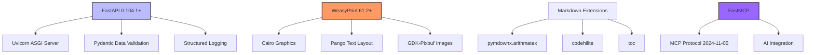

### Dependency Management
- **Package Manager**: uv (modern Python package management)
- **Configuration**: pyproject.toml with Hatch build system
- **Target Platform**: Python 3.11+ with Docker deployment
- **Lock File**: uv.lock for reproducible builds

## Architecture Overview

### System Architecture
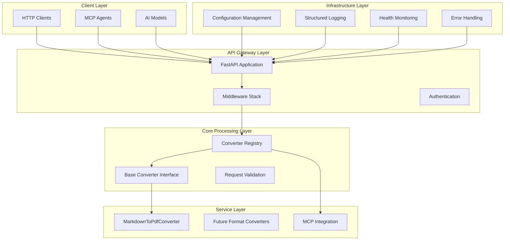

### Component Interactions
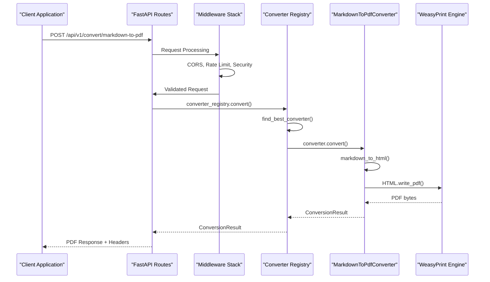

## API Endpoints Reference

### Standard Conversion API

#### Core Conversion Endpoints

| Endpoint | Method | Purpose | Input | Output |
|----------|--------|---------|-------|--------|
| `/api/v1/convert/markdown-to-pdf` | POST | Markdown to PDF conversion | JSON with markdown content | PDF binary |
| `/api/v1/convert/` | POST | Generic format conversion | JSON with content + format | Binary/Text |
| `/api/v1/convert/formats` | GET | List supported formats | None | JSON format list |
| `/api/v1/convert/converters` | GET | List available converters | None | JSON converter info |
| `/api/v1/convert/health` | GET | Conversion service health | None | JSON health status |

#### Request/Response Schema

**Markdown to PDF Request**:
```json
{
  "content": "# Document Title\n\nContent here...",
  "output_format": "pdf",
  "options": {
    "title": "Document Title",
    "include_toc": false,
    "custom_css": "body { font-family: Arial; }",
    "page_size": "A4",
    "margins": "2cm"
  }
}
```

**Success Response Headers**:
```
Content-Type: application/pdf
Content-Disposition: attachment; filename=doc_20241201_123456.pdf
X-Job-ID: md2pdf_20241201_123456_12345
X-Content-Size: 245760
```

### MCP Integration API

#### MCP Protocol Endpoints

| Endpoint | Method | Purpose | Authentication |
|----------|--------|---------|----------------|
| `/api/v1/mcp/capabilities` | GET | MCP server capabilities | API Key |
| `/api/v1/mcp/tools` | GET | Available MCP tools | API Key |
| `/api/v1/mcp/call` | POST | Execute MCP tool | API Key |
| `/api/v1/mcp/resources/{uri}` | GET | Get MCP resource | API Key |

#### MCP Tool Call Schema
```json
{
  "name": "convert_markdown_to_pdf",
  "arguments": {
    "content": "# AI Generated Report",
    "options": {
      "title": "AI Analysis Report",
      "include_toc": true
    }
  }
}
```

### System Health & Monitoring

#### Health Check Endpoints

| Endpoint | Method | Purpose | Response Codes |
|----------|--------|---------|----------------|
| `/health` | GET | Overall application health | 200, 207, 503 |
| `/` | GET | API information & status | 200 |
| `/docs` | GET | API documentation (dev only) | 200 |

#### Health Status Response
```json
{
  "app_name": "Kanvert",
  "app_version": "1.0.0",
  "environment": "production",
  "status": "healthy",
  "total_converters": 1,
  "healthy_converters": 1,
  "converters": {
    "markdown_to_pdf": "healthy"
  },
  "supported_formats": ["pdf"]
}
```

## Data Models & Schemas

### Core Data Models

#### ConversionRequest Model
```python
class ConversionRequest:
    content: str                    # Source document content
    output_format: ConversionFormat # Target format (PDF, HTML, etc.)
    options: Optional[Dict[str, Any]] # Format-specific options
    metadata: Optional[Dict[str, Any]] # Request metadata
```

#### ConversionResult Model
```python
class ConversionResult:
    job_id: str                     # Unique job identifier
    status: ConversionStatus        # COMPLETED, FAILED, PROCESSING
    output_data: Optional[bytes]    # Converted document data
    output_filename: Optional[str]  # Suggested filename
    error_message: Optional[str]    # Error details if failed
    metadata: Optional[Dict[str, Any]] # Processing statistics
    created_at: datetime           # Job creation timestamp
    completed_at: Optional[datetime] # Job completion timestamp
```

#### ConversionFormat Enum
```python
class ConversionFormat(str, Enum):
    PDF = "pdf"
    HTML = "html"
    DOCX = "docx"  # Future format
    TXT = "txt"    # Future format
```

### Data Flow Architecture
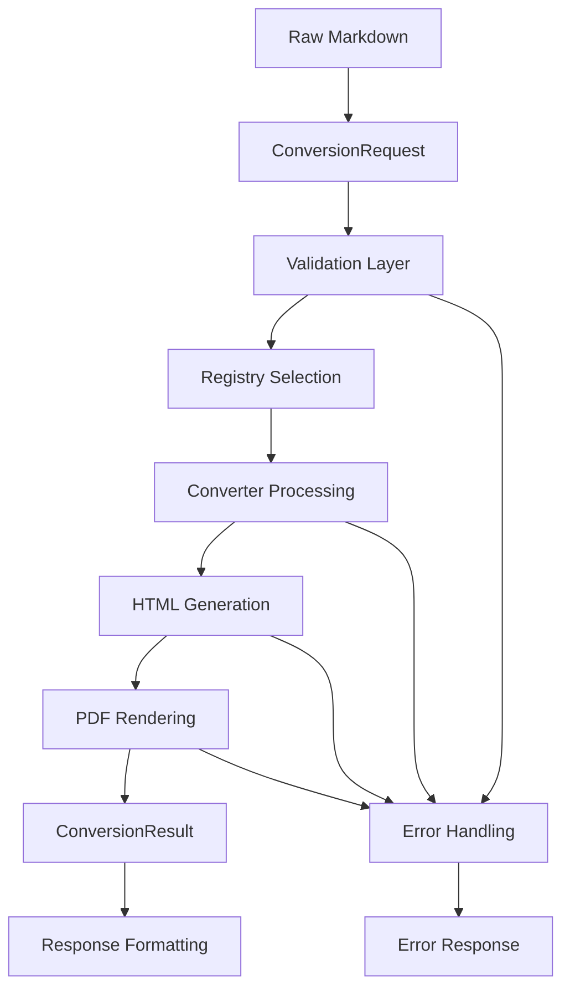

## Business Logic Layer

### Converter Registry Architecture

#### Registry Management
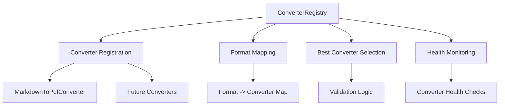

#### Converter Selection Algorithm
1. **Format Matching**: Find converters supporting target format
2. **Request Validation**: Check if converter can handle request
3. **Priority Selection**: Return first valid converter (extensible for prioritization)
4. **Fallback Handling**: Error if no suitable converter found

### Document Processing Pipeline

#### Markdown to PDF Conversion Flow
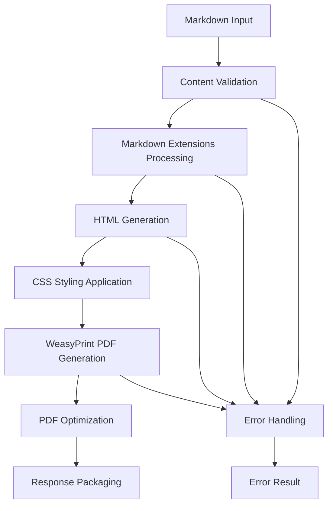

#### Processing Features
- **Markdown Extensions**: Tables, code highlighting, TOC, math equations
- **Custom Styling**: CSS injection, font configuration, page layout
- **Content Enhancement**: Automatic TOC generation, syntax highlighting
- **Optimization**: PDF compression, font embedding, metadata inclusion

### MCP Integration Logic

#### MCP Tool Registration
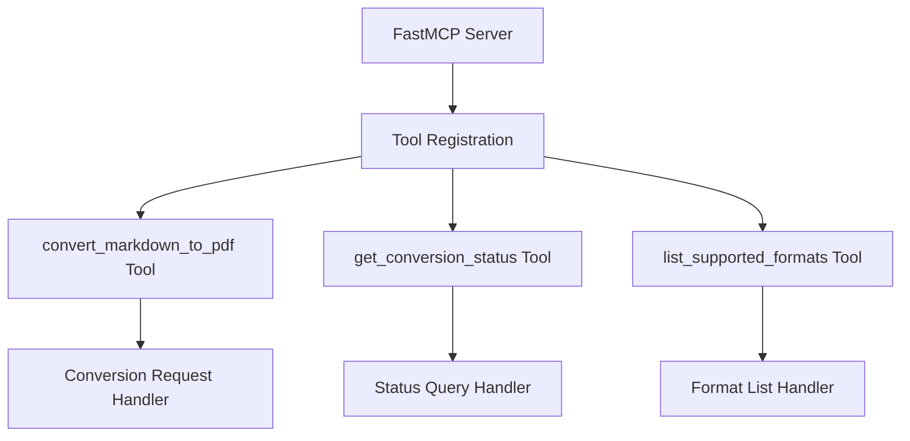

#### AI Workflow Integration
1. **Tool Discovery**: AI agents discover available conversion tools
2. **Schema Validation**: Request parameters validated against tool schema
3. **Async Processing**: Long-running conversions handled asynchronously
4. **Result Streaming**: Large PDFs streamed back to agents
5. **Error Propagation**: Detailed error information for agent decision-making

## Middleware & Interceptors

### Middleware Stack Architecture
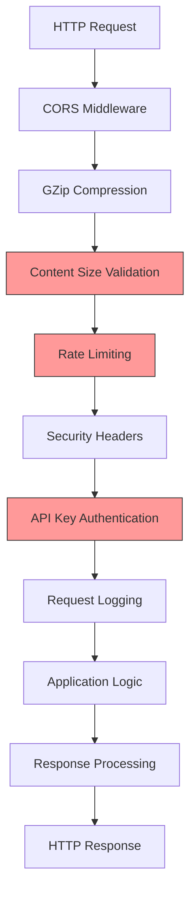

### Security Middleware

#### Content Size Protection
- **Request Size Limit**: 10MB maximum request size
- **Content Size Limit**: 5MB maximum content for conversion
- **Memory Protection**: Prevents memory exhaustion attacks
- **Streaming Validation**: Validates size during streaming

#### Rate Limiting Strategy
- **Request Rate**: 100 requests per minute per client
- **Conversion Rate**: Separate limits for compute-intensive operations
- **IP-based Tracking**: Rate limiting by client IP address
- **Exponential Backoff**: Gradual rate limit enforcement

#### API Key Authentication
```python
# Authentication flow
async def verify_api_key(request: Request) -> bool:
    api_key = request.headers.get("X-API-Key")
    if not api_key:
        return settings.api_key is None  # Allow if no key configured
    return api_key == settings.api_key
```

### Performance Middleware

#### Response Compression
- **GZip Compression**: Automatic compression for text responses
- **Binary Passthrough**: No compression for PDF/binary content
- **Compression Thresholds**: Minimum size requirements for compression

#### Request/Response Logging
```python
# Structured logging format
{
    "timestamp": "2024-01-01T12:00:00Z",
    "level": "INFO",
    "method": "POST",
    "path": "/api/v1/convert/markdown-to-pdf",
    "status_code": 200,
    "processing_time": 2.45,
    "content_size": 1024,
    "job_id": "md2pdf_20240101_120000_12345"
}
```

## Testing Strategy

### Test Architecture Overview
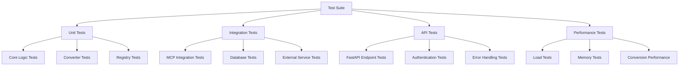

### Unit Testing Specifications

#### Core Component Tests
```python
# Registry testing patterns
class TestConverterRegistry:
    def test_converter_registration()
    def test_format_mapping()
    def test_best_converter_selection()
    def test_health_check_aggregation()
    def test_concurrent_access()
```

#### Converter Testing
```python
# Markdown converter testing
class TestMarkdownToPdfConverter:
    def test_basic_conversion()
    def test_extended_markdown_features()
    def test_custom_css_application()
    def test_large_document_handling()
    def test_conversion_error_scenarios()
    def test_async_processing()
```

### Integration Testing

#### API Integration Tests
```python
# FastAPI testing patterns
class TestConversionAPI:
    def test_successful_conversion_flow()
    def test_validation_error_handling()
    def test_rate_limiting_enforcement()
    def test_authentication_requirements()
    def test_content_size_limits()
    def test_concurrent_request_handling()
```

#### MCP Integration Tests
```python
# MCP protocol testing
class TestMCPIntegration:
    def test_tool_discovery()
    def test_tool_execution()
    def test_async_result_handling()
    def test_error_propagation()
    def test_large_response_streaming()
```

### Performance Testing

#### Load Testing Scenarios
1. **Concurrent Conversions**: 50 simultaneous PDF generations
2. **Large Document Processing**: 100+ page documents
3. **High Request Volume**: 1000 requests over 10 minutes
4. **Memory Stress Testing**: Memory usage under sustained load
5. **Error Recovery**: System behavior under failure conditions

#### Performance Benchmarks
- **Conversion Speed**: < 5 seconds for typical documents
- **Memory Usage**: < 500MB per conversion process
- **Throughput**: > 10 conversions per minute
- **Error Rate**: < 1% under normal load
- **Recovery Time**: < 30 seconds after failures

### Continuous Testing Pipeline

#### Test Automation Workflow
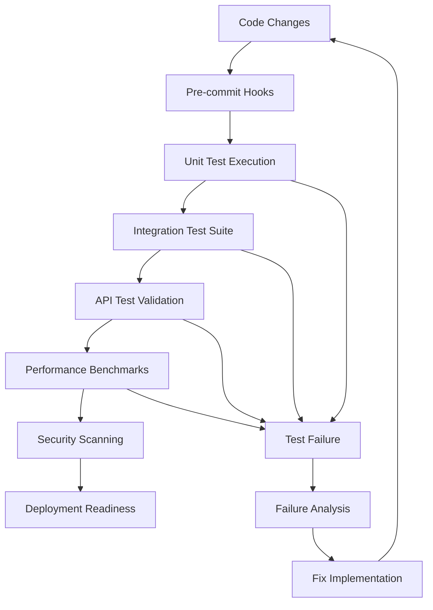

#### Quality Gates
1. **Unit Test Coverage**: Minimum 90% code coverage
2. **Integration Success**: All API endpoints functional
3. **Performance Thresholds**: No degradation in key metrics
4. **Security Validation**: No critical vulnerabilities
5. **Documentation Currency**: API docs updated with changes

## Production Operations

### Configuration Management

#### Environment-Specific Settings
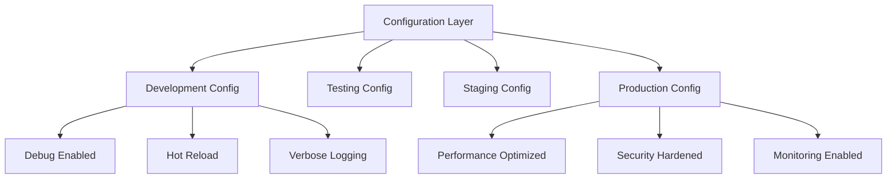

#### Settings Hierarchy
1. **Default Values**: Built-in sensible defaults
2. **Environment Files**: .env file overrides
3. **Environment Variables**: System environment overrides
4. **Command Line**: Runtime parameter overrides

### Health Monitoring

#### Health Check Implementation
```python
# Comprehensive health monitoring
async def comprehensive_health_check():
    return {
        "application": await check_app_health(),
        "dependencies": await check_dependency_health(),
        "converters": await check_converter_health(),
        "resources": await check_resource_health(),
        "performance": await check_performance_metrics()
    }
```

#### Monitoring Metrics
- **System Health**: CPU, memory, disk usage
- **Application Performance**: Request latency, throughput
- **Conversion Metrics**: Success rate, processing time
- **Error Tracking**: Error frequency, error types
- **Resource Utilization**: Temp directory usage, memory leaks

### Error Handling & Recovery

#### Error Classification
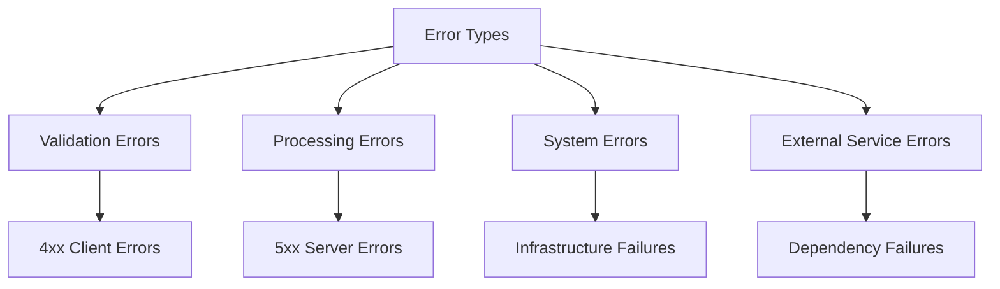

#### Recovery Strategies
1. **Graceful Degradation**: Continue operation with reduced functionality
2. **Automatic Retry**: Retry failed operations with exponential backoff
3. **Circuit Breaker**: Prevent cascade failures in external dependencies
4. **Fallback Responses**: Provide meaningful error responses to clients
5. **Health Recovery**: Automatic service recovery after dependency restoration

### Deployment Architecture

#### Container Configuration
```dockerfile
# Production-optimized container
FROM python:3.11-slim
RUN apt-get update && apt-get install -y \
    cairo-dev pango1.0-dev gdk-pixbuf2.0-dev libffi-dev
COPY requirements.txt .
RUN pip install -r requirements.txt
COPY . /app
WORKDIR /app
CMD ["uvicorn", "kanvert.main:app", "--host", "0.0.0.0", "--port", "8000"]
```

#### Scaling Considerations
- **Horizontal Scaling**: Multiple container instances behind load balancer
- **Resource Allocation**: CPU and memory limits per container
- **State Management**: Stateless design for easy scaling
- **Load Balancing**: Distribution of conversion workload
- **Auto-scaling**: Dynamic scaling based on load metrics


